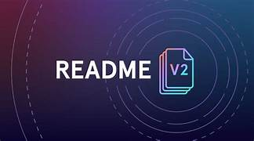

    

<h1 id="descricao" align="center">Padrão README</h1>

Este README tem o objetivo de apresentar uma boa documentação referente a projetos no GITHUB.

#### será apresentado o segunite:

- Badges
- Menu / Tabela de Conteúdo
- Tecnologias ultilizadas
 
 

## Tabela de contúdo

<ul>
    <li> <a href="#descricao">Descrição Projeto</a></li>
    <li> <a href="StatusdoProjeto">Status do Projeto</a></li>
     <li> <a href="TabeladeConteudo">Tabela de Conteúdo </a></li>
     <li> <a href="tecnologias">Tecnologias</a></li>
</ul>

<!-- ou -->
<!-- <ul>
     <a href="#descricao">Descrição Projeto</a>
   <a href="">Tecnologias</a>
</ul> -->

## :rocket: Status do Projeto
<h4> Em construção</h4>

# ✔️ Características
Cadastro de usuário

Cadastro de cliente

Cadastro de produtos

# Pré-requisitos

Antes de começar você precisa instalar em sua máquina as seguintes ferramentas: <a href="https://git-scm.com/">Git</a> e <a href="https://dotnet.microsoft.com/pt-br/download/dotnet/6.0">Donet 6.</a>

Além disto é bom ter um editor para trabalhar com o código como <a href="https://code.visualstudio.com/">VScode </a>

## 🔨 Rodando o Back End (servidor)

## 🗺️ Mapa do Projeto

Abaixo segue a estrutura de pastas e suas definições:

##  ⚙ Tecnologias

As seguintes ferramentas foram usadas na construção do projeto:

- <a href="https://dotnet.microsoft.com/pt-br/download/dotnet/6.0"> Dotnet</a>
- <a href="https://dotnet.microsoft.com/pt-br/download/dotnet/6.0"> C#</a>
- <a href="https://www.rabbitmq.com/"> CoelhoMQ</a>
- <a href="https://www.microsoft.com/pt-br/sql-server/sql-server-downloads">ServidorSQL</a>

#### Lançamentos
Nenhum lançamento publicado

#### Pacotes
Nenhum pacote publicado

